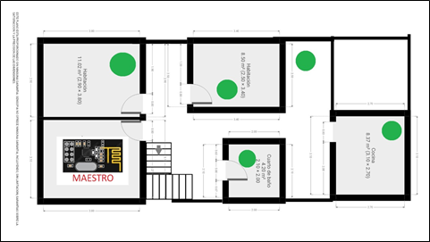
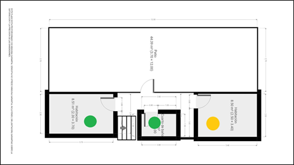
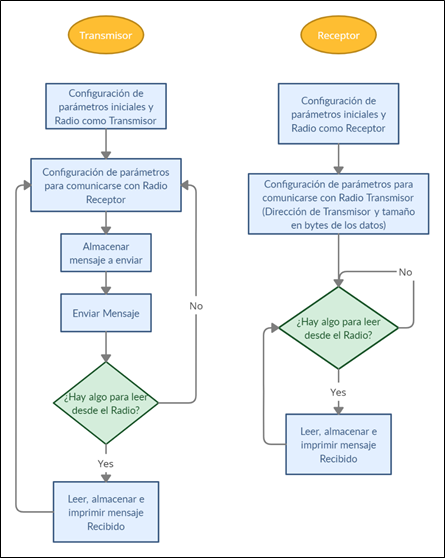

# Pruebas de comunicación Radios NRF24L01

El radio NRF24L01 está diseñado para trabajar en la banda de frecuencia ISM de 2,4GHz, adicionalmente, el fabricante indica que tiene 126 canales de frecuencia seleccionables, lo que se traduce en un rango de trabajo entre 2,4GHz y 2,515GHz. Tiene una potencia de transmisión de datos de 0,-6,-12 o -18dBm y una tasa de trasferencia de 250kbps, 1Mbps o 2Mbps.

Para integrar el radio NRF24L01 y el microcontrolador, es necesario utilizar una librería ([nRF24L01](https://os.mbed.com/components/nRF24L01/))  desarrollada por un miembro de la comunidad Mbed para dicho dispositivo. Esta librería proporciona una serie de funciones que facilitan la configuración y manipulación de los radios por parte del STM32.

## Descripción prueba de comunicación

Se realizó una prueba con un maestro transmisor y un esclavo receptor, donde el maestro envía repetidamente un mensaje a la dirección y frecuencia a las que se encuentra configurado el esclavo. Se espera que este último al recibir el mensaje lo envíe mediante el puerto serial del microcontrolador a un PC. 

El transmisor se ubicó en diferentes habitaciones del hogar, mientras que el receptor se posicionó en un segundo piso (punto medio a nivel del escenario usado) para que, al recibir el mensaje, este sea impreso en un terminal (Putty).

## Escenario bajo prueba:
### Plano primera planta

### Plano Segunda planta

### Plano Tercera planta


## Interpretación de Resultados:

| Ubicación del Receptor | Ubicación del Transmisor | Distancia (m) | Tiempo Transcurrido para la recepción de datos | Color |
| :---:         |     :---:      |          :---: |          :---: |          :---: |
| Segundo Piso | Primer Piso | 6 | 1-15 Segundos |  |
| Segundo Piso | Primer Piso | 10 | >15 Segundos |  |
| Segundo Piso | Primer Piso | 10| >15 Segundos |  |
| Segundo Piso | Primer Piso | 11 | >15 Segundos |  |
| Segundo Piso | Segundo Piso | 4 | 1-15 Segundos |  |
| Segundo Piso | Segundo Piso | 5 | 1-15 Segundos |  |
| Segundo Piso | Segundo Piso | 5 | 1-15 Segundos |  |
| Segundo Piso | Segundo Piso | 8 | 1-15 Segundos |  |
| Segundo Piso | Segundo Piso | 10 | 1-15 Segundos |  |
| Segundo Piso | Tercer Piso | 3 | 1-15 Segundos |  |
| Segundo Piso | Tercer Piso | 6 | 1-15 Segundos |  |
| Segundo Piso | Tercer Piso | 12 | >15 Segundos |  |


### Diagramas de flujo simplificados



## 1. Transmisión de Datos
 ```c
//CODIGO DE PRUEBAS PARA DIRECCIONAMIENTO
//DE RADIOS nRF24L01                                                       

#include "mbed.h"
#include "nRF24L01P.h"

#define RETARDO 2000
#define MI_FREQ 2400
#define POT  0
#define VELO 250
#define TAM_MI_D 3
#define MI_DIREC 0x000002   //DIRECCION DE RECEPCION DEL MAESTRO

#define DIR_1 0x000006      //DIRECCION DE RECEPCION EXCLAVO 1
#define TAM_R1 3
#define RF_RAD1 2425

#define DIR_2 0x00000A      //DIRECCION DE RECEPCION EXCLAVO 2
#define TAM_R2 3
#define RF_RAD2 2460

#define TAM_TX 4
#define TAMANO 4


nRF24L01P RADIO(PB_5, PB_4, PB_3, PA_15, PA_12);    // MOSI, MISO, SCK, CSN, CE, IRQ
Serial PC (PA_2,PA_3);  //TX,RX
DigitalOut ON(PC_13);

void CONF_INIC (int FRECUENCIA, int POTENCIA, int VELOCIDAD, unsigned long long DIRECCION, int ANCHO, int TUBERIA);
void ESTADO_I (void);
void PREPARAR (int ANCHO, unsigned long long DIRECCION, int TAM_DIR, int RF);
void RECIBIR (void);

char DATA_TX [TAM_TX];
char RX_DATA [TAMANO];
int  TX_CONT = 0;
int RECIBO  = 1;

int main (void)
{
    ON = 1;
    RADIO.powerUp();
    CONF_INIC (MI_FREQ, POT, VELO, MI_DIREC, TAM_MI_D, NRF24L01P_PIPE_P0);
    ESTADO_I ();
    RADIO.setTransmitMode();
    RADIO.enable();
    //RADIO.enableAutoRetransmit (1000,10);      //PRUEBA
    while (1)
    {
        PREPARAR (TAM_TX, DIR_1, TAM_R1, RF_RAD1);    //  TAMANO EN BYTES, DIRECCION, TAM_DIR, RF
        DATA_TX[0] = 'H';
        DATA_TX[1] = 'i';
        DATA_TX[2] = 'R';
        DATA_TX[3] = 'A';
        PC.printf( "\n\r***********************\n\r");
        PC.printf( "COMUNICANDO CON RADIO 1\n\r");
        PC.printf( "***********************\n\r");
        //ESTADO_I ();
        RADIO.write(NRF24L01P_PIPE_P0, DATA_TX, TAM_TX);
        TX_CONT = 0;
        RECIBO = 1;
        wait_ms (RETARDO);
        /*
        PREPARAR (TAM_TX, DIR_2, TAM_R2, RF_RAD2);
        DATA_TX[0] = 'H';
        DATA_TX[1] = 'i';
        DATA_TX[2] = 'R';
        DATA_TX[3] = 'B';
        PC.printf( "\n\r***********************\n\r");
        PC.printf( "COMUNICANDO CON RADIO 2\n\r");
        PC.printf( "***********************\n\r");
        ESTADO_I ();
        RADIO.write(NRF24L01P_PIPE_P0, DATA_TX, TAM_TX);
        TX_CONT = 0;
        RECIBO = 1;
        wait_ms (RETARDO);*/
        if(RADIO.readable())
        {
            RECIBIR();
            //wait_ms TIEMPO_MS;
        }    
    }   
}
void CONF_INIC (int FRECUENCIA, int POTENCIA, int VELOCIDAD, unsigned long long DIRECCION, int ANCHO, int TUBERIA)
{
    RADIO.setRfFrequency(FRECUENCIA);
    RADIO.setRfOutputPower(POTENCIA);
    RADIO.setAirDataRate(VELOCIDAD);
    RADIO.setRxAddress(DIRECCION, ANCHO, TUBERIA);
}
void ESTADO_I (void)
{
    PC.printf( "FRECUENCIA DE OPERACION     : %d MHz\r\n",  RADIO.getRfFrequency() );
    PC.printf( "POTENCIA DE TRANSMISION     : %d dBm\r\n",  RADIO.getRfOutputPower() );
    PC.printf( "VELOCIDAD DE TRANSMISION    : %d kbps\r\n", RADIO.getAirDataRate() );
    PC.printf( "DIRECCION DE TX             : 0x%010llX\r\n", RADIO.getTxAddress() );
    PC.printf( "DIRECCION DE RX             : 0x%010llX\r\n", RADIO.getRxAddress(0) );
}
void PREPARAR (int ANCHO, unsigned long long DIRECCION, int TAM_DIR, int RF)
{
    RADIO.setTransferSize (ANCHO);
    RADIO.setTxAddress (DIRECCION,TAM_DIR);
    RADIO.setRfFrequency (RF);
}
void RECIBIR (void)
{
    int rxDataCnt = 0;
    
    RADIO.read(NRF24L01P_PIPE_P0, RX_DATA, TAMANO);
    for(int i = 0; i<=TAMANO; i++)
    {
        PC.printf("%c",RX_DATA[i]);
    }
    PC.printf("\r\n");
}
 ```

## 2. Recepción de Datos

```c
//CODIGO DE PRUEBAS PARA RECEPCION DE DATOS
//EN RADIOS nRF24L01                                                         

#include "mbed.h"
#include "nRF24L01P.h"

#define TIEMPO_MS       (3000)

#define FRECUENCIA_T    2425
#define POTENCIA_T      0
#define VEL_T           250
#define MI_DIRECC       0x000006
#define TAMANO_DIR      3

#define MI_FREQ 2400
#define MAESTRO 0x000002
#define TAM_MI_D 3
  
#define TAMANO          4

Serial PC(PA_2,PA_3);//TX,RX
nRF24L01P my_nrf24l01p(PB_5, PB_4, PB_3, PA_15, PA_12);    // MOSI, MISO, SCK, CSN, CE, IRQ----IRQ NO ESTA DEFINIDO NI CONECTADO, LA RECOMENDACION VIENE DADA POR LA LIBRERIA USADA

void CONF_GENER (int FRECUENCIA, int POTENCIA, int VELOCIDAD, unsigned long long DIRECCION_RX, int TAMAÑO_D, int TUBERIA);
void CONF_RADIO (unsigned long long DIRECCION_TX, int TAM_INFO);
void RECIBIR (void);

char RX_DATA [TAMANO];
char DATA_TX [TAMANO];
int  TX_CONT = 0;

int main ()
{
    my_nrf24l01p.powerUp();                                                                             //Radio ENCENDIDO y en modo STANDBY
    CONF_GENER (FRECUENCIA_T, POTENCIA_T, VEL_T, MI_DIRECC, TAMANO_DIR, NRF24L01P_PIPE_P0);                     //CONFIGURACION INICIAL radio
    CONF_RADIO (MAESTRO, TAMANO); 
    PC.printf("********************CONF_INICIAL********************\r\n");                              //DIRECCION INICIAL de Transmision
    PC.printf("****************************************************\r\n");                                                                                           //Imprimir en el terminal CONFIGURACION INICIAL del RADIO
    my_nrf24l01p.setReceiveMode(); //Modo de RECEPCION ACTIVADO
    my_nrf24l01p.enable();
    
    while (1)
    { 
        if(my_nrf24l01p.readable())
        {
            RECIBIR();
            PC.printf("RADIO 1 RECIBIO DATOS\r\n");
        }
    }   
}

void CONF_GENER (int FRECUENCIA, int POTENCIA, int VELOCIDAD, unsigned long long DIRECCION_RX, int TAMAÑO_D, int TUBERIA)
{
    my_nrf24l01p.setRfFrequency(FRECUENCIA);                        //FRECUENCIA de TRANSMISION en MHz  (2400-2525)
    my_nrf24l01p.setRfOutputPower(POTENCIA);                        //POTENCIA DE SALIDA EN dBm
    my_nrf24l01p.setAirDataRate(VELOCIDAD);                         //Velocidad de TRASNFERENCIA de Datos en KBTS/S
    my_nrf24l01p.setRxAddress(DIRECCION_RX, TAMAÑO_D, TUBERIA);     //Configuracion de DIRECCION de RECEPCION (DIRECCION, TAMAÑO de la DIRECCION en bytes, TUBERIA 0-5) LAS TUBERIAS 0 Y 1 admiten tamaños de 3,4,5 bytes. Las Demas por defecto solo tienen un byte de tamaño para la direccion
}
void CONF_RADIO (unsigned long long DIRECCION_TX, int TAM_INFO)
{
    my_nrf24l01p.setTxAddress(DIRECCION_TX, TAMANO_DIR);              //Configuracion de DIRECCION de TRANSMISION (DIRECCION, TAMAÑO de la DIRECCION en bytes) LA TUBERIA va directamente LIGADA a la configurada en la RECEPCION
    my_nrf24l01p.setTransferSize(TAM_INFO);                           //ESTABLECER el TAMAÑO en BYTES de la TRANSFERENCIA 
}    
void RECIBIR (void)
{
    int rxDataCnt = 0;
    
    my_nrf24l01p.read(NRF24L01P_PIPE_P0, RX_DATA, TAMANO);
    for(int i = 0; i<=TAMANO; i++)
    {
        PC.printf("%c",RX_DATA[i]);
    }
    PC.printf("\r\n");
}
```