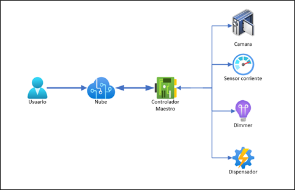

# IoT-Home-Sistem-with-STM32-and-Raspberry

Este repositorio consigna toda la información relacionada con el desarrollo de un sistema de IoT para controlar y/o monitorear 4 eventos concretos en un hogar: 

1. Ingreso a la vivienda.
2. Monitoreo de consumo eléctrico en tomacorrientes.
3. Encendido, apagado y dimerización de luces.
4. Dispensado de bebida y alimento para mascotas.

## Esquema General de la Solución

El sistema es capaz de detectar las órdenes fijadas por el usuario mediante Ubidots y direccionar cada orden al módulo encargado de la tarea por medio del controlador maestro. Además, cada módulo que requiere enviar información hacia Ubidots (como es el caso del sensor de corriente) envía los datos al controlador maestro, y este se encarga de actualizar la información en la nube mediante la SBC.

## Esquema General del Controlador Maestro y Módulos de Control

El intercambio de información entre los diferentes módulos de control y un único controlador maestro se realizó implementando comunicación RF en la banda ISM mediante los radios de comunicación nRF24L01 con antena integrada.

La tarjeta de desarrollo implementada en esta solución es la Blue Pill que incorpora un STM32F103C8, una CPU Cortex-M3 de 32-bits.

La SBC que enlaza las ordenes enviadas por el usuario en la nube con el sistema es la Raspberry Pi 4 de 2GB de RAM.

