# IoT-Home-Sistem-with-STM32-and-Raspberry

Este repositorio consigna toda la información relacionada con el desarrollo de un sistema de IoT para controlar y/o monitorear 4 eventos concretos en un hogar: 

1. Ingreso a la vivienda.
2. Monitoreo de consumo eléctrico en tomacorrientes.
3. Encendido, apagado y dimerización de luces.
4. Dispensado de bebida y alimento para mascotas.

## Esquema General de la Solución

El sistema es capaz de detectar las órdenes fijadas por el usuario en la nube y direccionar cada orden al módulo encargado de la tarea a realizar por medio del controlador maestro. Además, cada módulo que requiere enviar información hacia la nube (como es el caso del sensor de corriente) envía los datos al controlador maestro, y este se encarga de actualizar la información en la nube mediante la SBC.

## Esquema General del Controlador Maestro y Módulos de Control

## Generalidades del Sistema

### DASHBOARD:
El dashboard mediante el cual el usuario puede indicar las tareas a realizar en cada módulo de control es [Ubidots](https://ubidots.com/), una plataforma IoT que permite conectar hardware con la nube mediante diferentes protocolos de comunicación como HTTP, MQTT, TCP, entre otros. Esta plataforma nos permite crear diferentes tableros que incorporan botones, gráficos, alertas y demás elementos que permiten visualizar, modificar y/o monitorear los valores de las variables ligadas a cada uno de los elementos que componen el dashboard. 

### CONTROLADOR MAESTRO:

Para poder establecer una comunicación entre en dashboard en la nube y el controlador maestro es necesario contar con un dispositivo con capacidad de conexión a internet. A su vez para conectar el controlador maestro con los módulos de control se requiere que la SBC tenga puertos de entrada, salida e interfaces de comunicación. 

Teniendo en cuenta lo anterior, el controlador maestro implementado a partir de una SBC es básicamente un puente entre el dashboard en la nube y los módulos periféricos que son los que realizan las mediciones y/o acciones.
## Esquema de enlace entre Dashboard y módulos de control mediante el controlador maestro

- La SBC que enlaza las ordenes enviadas por el usuario en la nube con el sistema es la Raspberry Pi 4 de 2GB de RAM, a la cual se le instaló el sistema operativo [Raspbian](https://www.raspberrypi.com/software/).

- La tarjeta de desarrollo implementada en esta solución es la Blue Pill que incorpora un STM32F103C8, una CPU Cortex-M3 de 32-bits. La programación de dicha tarjeta se realizó mediante [Mbed Online Compiler](https://os.mbed.com/).

- El intercambio de información entre los diferentes módulos de control y un único controlador maestro se realizó implementando comunicación RF en la banda ISM mediante los radios de comunicación nRF24L01 con antena integrada. La librería usada en Mbed para integrar el radio con la Blue Pill fue [nRF24L01](https://os.mbed.com/components/nRF24L01/)

# Componentes principales de la solución

| Componente | Aspecto Físico | Aspecto Físico |
| :---:         |          :--- |          :---: |
| Raspberry Pi 4                | **Procesador:** ARM corex-A72 64bits 4 núcleos 1.5 GHz  **GPU:** Video Core VI  **Memoria RAM:** 2GB  **Puertos:** Pines GPIO (40), micro HDMI (2), USB 2.0 (2), USB 3.0 (2)  **Conectividad:** WI-FI, Bluetooth 5.0, Gigabit Ethernet |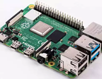 |
| Blue Pill                     | **Voltaje de operación:** 3.3V  **Pines analógicos:** 10  **Pines Digitales:** 37  **Protocolos de comunicación:** SPI (2), UART (3), I2C (2)  **Memoria flash:** 64/128 KB  **Memoria SRAM:** 20KB   | |
| Radio nRF24L01                | **Modulo transceptor** **Voltaje de operación:** 3.3V **Protocolo de comunicación:** SPI **Frecuencia:** 2.4 GHz – 2.5GHz **Canales RF:** 126 **Alcance:** 20m – 30m | |
| Cámara IP                     | **Modelo:** V380 **Protocolo:** ONVIF **Visión nocturna** **Conectividad:** WIFI, Red RJ45 **Resolución:** 1080p |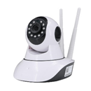 |
| Motor DC                      | **Modelo JGY370** **Motor con motorreductor de engranajes** **Voltaje de operación:** 12V DC **Corriente de operación:** 0.5A **Velocidad:** 40RPM **Torque:** 3 Kg/cm |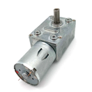 |
| Motobomba DC                  | **Modelo:** R385 **Voltaje de operación:** 12V DC **Corriente de operación:** 0.5-0.7A **Dimensiones:** 90mm x 40 mm x 35mm **Flujo volumétrico:** 1.5-2 L/min **Diámetro de salida:** 6mm | |
| Módulo Puente H               | **Circuito Integrado:** L298 **Voltaje de operación:** 5V DC **Corriente de operación:** 36mA **Número de canales:** 2 **Voltaje por canal:** 5V DC - 35V DC **Corriente MAX por canal:** 2A |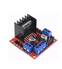 |
| Conversor AC/DC               | **Modelo:** Hi-link (HLK-PM01) **Voltaje de entrada:** 100-240V AC **Voltaje de salida:** 5V DC **Corriente de salida:** 0.6A DC  | |
| Regulador de Voltaje          | **Modelo:** L78L33 **Voltaje Max entrada:** 30V DC **Voltaje de salida:** 3.3V DC **Corriente de salida:** 100mA |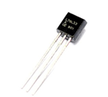 |
| Amplificador Operacional      | **Modelo:** LM358 **Numero de amplificadores:** 2 **Voltaje de operación:** 3V – 32V **Voltaje offset entradas:** 2mV **Ganancia de voltaje diferencial:** 100 dB | |
| Amplificador Operacional      | **Modelo:** TL084 **Entradas transistores JFET** **Numero de amplificadores:** 4 **Voltaje de operación:** ± 18V **Voltaje offset entradas:** 3mV |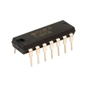 |
| Optoacoplador                 | **Modelo:** MOC 3021 **Salida:** Fototriac **Voltaje directo Max LED:** 1.5V **Corriente Max LED:** 60mA **Corriente de activación LED:** 15-30mA **Voltaje Max salida:** 400Vp | |
| Tiristor                      | **Modelo:** TRIAC BT138 **Valor instantáneo máximo de pulsos de voltaje (VDRM):** 600V **Valor de corriente RMS ánodo-cátodo en directo (IT):** 12A **Valor pico máximo de corriente encendido:** 95A **Voltaje pico de gate (VGM):** 5V **Corriente máxima Trigger Gate:** 70mA | |
| Transformador de Corriente    | **Modelo:** ZMCT103C **Rango corriente de entrada:** 0 - 10A (50Ω) **Rango corriente de salida:** 5mA **Proporción:** 1000:1 **Linealidad:** ≤0.2% **Voltaje de aislamiento:** 4500V | |
| Contacto Magnético            | **Tipo:** Interruptor Reed Switch **Voltaje máximo:** 100V DC **Corriente máxima:** 0.5A **Potencia:** 10W **Distancia de actuación:** 20-25mm |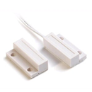 |

# Solución Final

## Dashboard en Ubidots

## Controlador Maestro

### Tarjeta de circuito impreso módulo controlador maestro

### Conexión módulo maestro y Raspberry Pi

## Módulo de Monitoreo de Puerta
### Tarjeta de circuito impreso módulo monitoreo de puerta

### Foto cámara implementada

### Foto contacto magnético en puerta

### Correo electrónico con grabación

## Módulo Sensor de Corriente
### Tarjeta de circuito impreso módulo sensor de corriente

### Tablero de pruebas módulo sensor de corriente
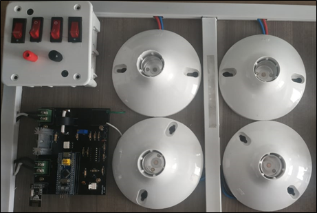
### Diagrama tablero de pruebas

### Medición realizada por el sensor-vs-corriente leida por Multuimetro Unit UT39C

## Módulo Dimmer
### Tarjeta de circuito impreso módulo dimmer

### Carga al 30%

### Carga al 100%

## Módulo Dispensador de Comida y Bebida para Mascotas
### Tarjeta de circuito impreso módulo dispensador

### Conexiones módulo dispensador con Puente H
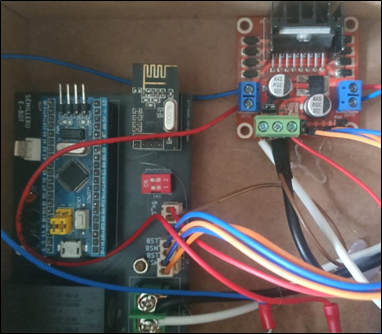
### Dispensador de comida (motor y tornillo sin fin)
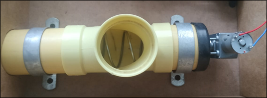
### Dispensador de agua (motobomba)

### Prototipo de dispensador de comida y bebida para mascotas
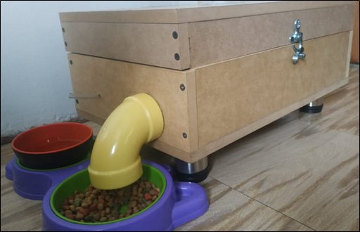