# IoT-Home-Sistem-with-STM32-and-Raspberry

Este repositorio consigna toda la información relacionada con el desarrollo de un sistema de IoT para controlar y/o monitorear 4 eventos concretos en un hogar: 

1. Ingreso a la vivienda.
2. Monitoreo de consumo eléctrico en tomacorrientes.
3. Encendido, apagado y dimerización de luces.
4. Dispensado de bebida y alimento para mascotas.

## Esquema General de la Solución

El sistema es capaz de detectar las órdenes fijadas por el usuario en la nube y direccionar cada orden al módulo encargado de la tarea a realizar por medio del controlador maestro. Además, cada módulo que requiere enviar información hacia la nube (como es el caso del sensor de corriente) envía los datos al controlador maestro, y este se encarga de actualizar la información en la nube mediante la SBC.

## Esquema General del Controlador Maestro y Módulos de Control

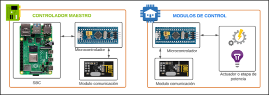

## Generalidades del Sistema

### DASHBOARD:
El dashboard mediante el cual el usuario puede indicar las tareas a realizar en cada módulo de control es [Ubidots](https://ubidots.com/), una plataforma IoT que permite conectar hardware con la nube mediante diferentes protocolos de comunicación como HTTP, MQTT, TCP, entre otros. Esta plataforma nos permite crear diferentes tableros que incorporan botones, gráficos, alertas y demás elementos que permiten visualizar, modificar y/o monitorear los valores de las variables ligadas a cada uno de los elementos que componen el dashboard. 

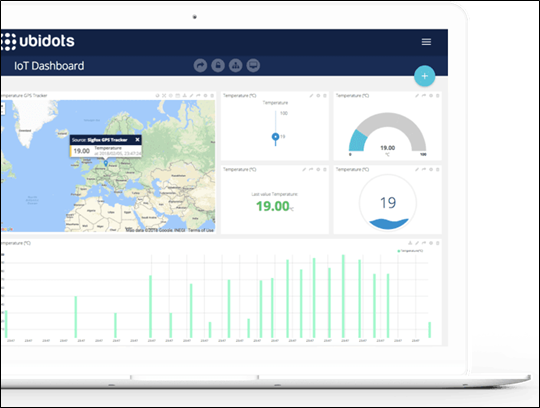

### CONTROLADOR MAESTRO:

Para poder establecer una comunicación entre en dashboard en la nube y el controlador maestro es necesario contar con un dispositivo con capacidad de conexión a internet. A su vez para conectar el controlador maestro con los módulos de control se requiere que la SBC tenga puertos de entrada, salida e interfaces de comunicación. 

Teniendo en cuenta lo anterior, el controlador maestro implementado a partir de una SBC es básicamente un puente entre el dashboard en la nube y los módulos periféricos que son los que realizan las mediciones y/o acciones.

- La SBC que enlaza las ordenes enviadas por el usuario en la nube con el sistema es la Raspberry Pi 4 de 2GB de RAM, a la cual se le instaló el sistema operativo [Raspbian](https://www.raspberrypi.com/software/).

- La tarjeta de desarrollo implementada en esta solución es la Blue Pill que incorpora un STM32F103C8, una CPU Cortex-M3 de 32-bits. La programación de dicha tarjeta se realizó mediante [Mbed Online Compiler](https://os.mbed.com/).

- El intercambio de información entre los diferentes módulos de control y un único controlador maestro se realizó implementando comunicación RF en la banda ISM mediante los radios de comunicación nRF24L01 con antena integrada. La librería usada en Mbed para integrar el radio con la Blue Pill fue [nRF24L01](https://os.mbed.com/components/nRF24L01/)

# Componentes principales de la solución

| Componente | Aspecto Físico |
| :---         |          ---: |
| Raspberry Pi 4                |  |
| Blue Pill                     |  |
| Radio nRF24L01                | 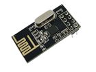 |
| Cámara IP                     |  |
| Motor DC                      |  |
| Motobomba DC                  | 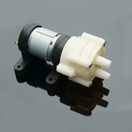 |
| Módulo Puente H               |  |
| Conversor AC/DC               |  |
| Regulador de Voltaje          |  |
| Amplificador Operacional      |  |
| Amplificador Operacional      |  |
| Optoacoplador                 | 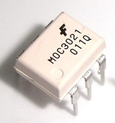 |
| Tiristor                      | 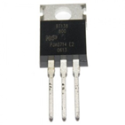 |
| Transformador de Corriente    |  |
| Contacto Magnético            |  |

# Solución Final

## DashBoard en Ubidots

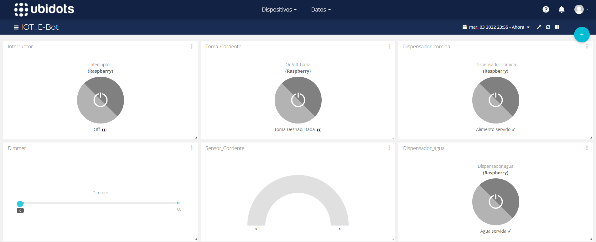

## Controlador Maestro

## Módulo de Monitoreo de Puerta

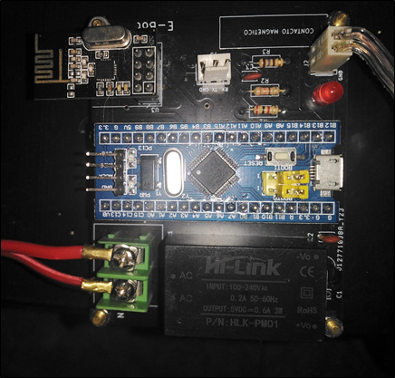

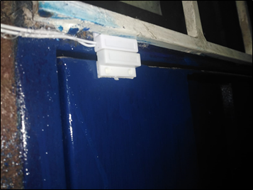

## Módulo Sensor de Corriente

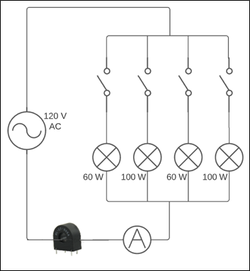

## Módulo Dimmer

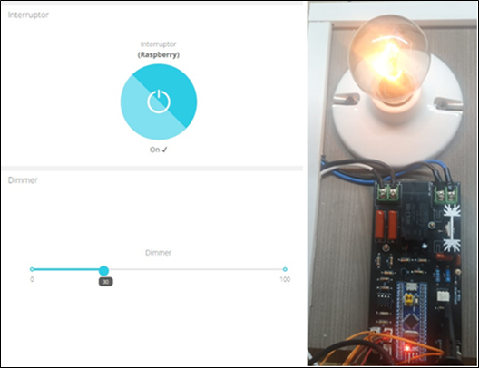

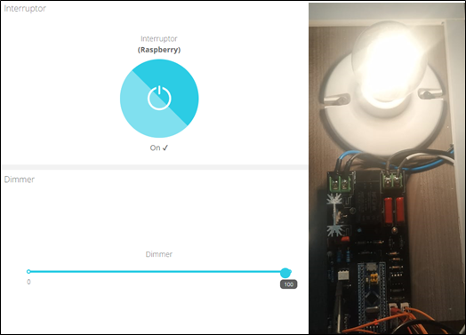

## Módulo Dispensador de Comida y Bebida para Mascotas

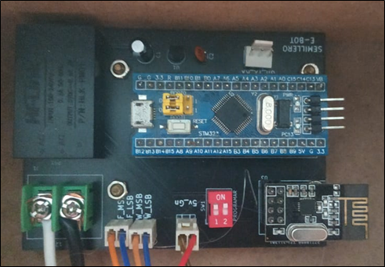

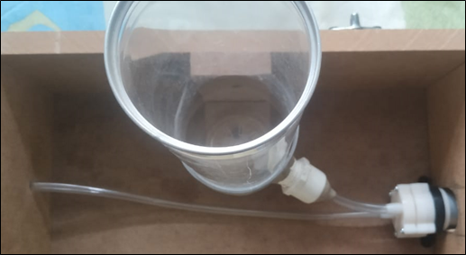

